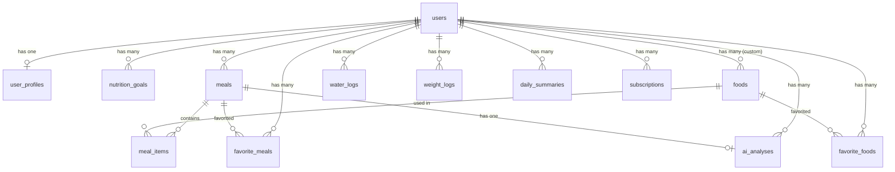

# Database ERD

```mermaid
erDiagram
    users ||--o| user_profiles : "has one"
    users ||--o{ nutrition_goals : "has many"
    users ||--o{ meals : "has many"
    users ||--o{ foods : "has many (custom)"
    users ||--o{ water_logs : "has many"
    users ||--o{ weight_logs : "has many"
    users ||--o{ daily_summaries : "has many"
    users ||--o{ favorite_foods : "has many"
    users ||--o{ favorite_meals : "has many"
    users ||--o{ subscriptions : "has many"
    users ||--o{ ai_analyses : "has many"

    meals ||--o{ meal_items : "contains"
    meals ||--o| ai_analyses : "has one"

    foods ||--o{ meal_items : "used in"
    foods ||--o{ favorite_foods : "favorited"

    meals ||--o{ favorite_meals : "favorited"
```
